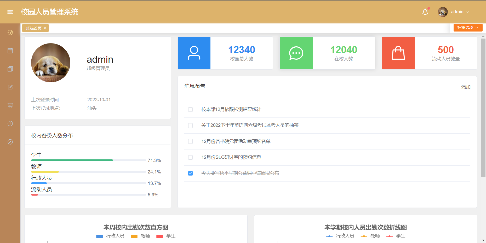

# 校园人员管理系统

基于 Vue3 + Element Plus + mysql 的校园人员管理系统，开发环境为windows。

## 设计原因
为了更好地管理在校人员及进校流动人员，特此建立校园人员管理系统。
面向对象是行政人员等服务人员，使校园人员数据透明化、数字化。

## 项目结构
SCHOOLPEOPLE_MANAGE/

|-- screenshots 界面预览

|-- src

|    |-- api 前端调用本地文件和后端数据的接口

|    |-- assets 资产，包括图片和数据

|    |-- calc 数据相关的计算函数

|    |-- components 工作台组件的设计

|    |-- router 管理系统的各页面路由

|    |-- server node.js连接后端数据库

|    |-- store 权限设置，动态菜单，tags标签页相关方法

|    |-- utils 公共工具，包括axios

|    |-- views 各前端页面的具体设计

|    |-- App.vue 全局css样式设置

|    |-- main.ts 项目配置

|    |-- vite-env.d.ts

|-- 文字资料 开发中记录的文件资料，包括数据库定义

|-- Readme.md 项目概述

|-- vite.config.ts

|-- index.html  web网页配置，包含标签名称

 

## 项目架构

 

## 数据类设计
### 教师管理信息

*属性*

1）注册时间

2）状态：到岗/出差/未到

3）出勤率

4）姓名，学院，职位

5）职称

6）课程信息

*操作*

1）数据库CRUD：增加/修改/删除/查询信息

 

### 学生管理信息
*属性*

1）学生信息：学号，名称，学院/系

2）一卡通账号

3）学籍状态：休学/留校查看/在读

4）邮箱账号

5）宿舍

*操作*

1）数据库CRUD：增加/修改/删除/查询信息

  a）删除：删除劝退人员等

2）向该名同学的邮箱发布学业/违规警告

 

### 流动人员信息

*属性*

1）人员信息：名称，年龄，进校时间

2）状态：仍在校/已出校

3）进校原因-修改时无法修改

*操作*

1）数据库CRUD：增加/修改/删除/查询信息

 

### 行政人员信息（包括辅导员）
*属性*

1）人员信息：ID，名称，年龄，注册时间

2）状态：到岗/出差/未到

3）出勤率

4）部门

5）邮箱

*操作*

1）数据库CRUD：增加/修改/删除/查询信息

2）向该名人员的邮箱发布违规警告

 

## 项目截图

### 登录

### 首页

 

## License

[MIT](https://github.com/Achenganggyel/School-People-Manage)
